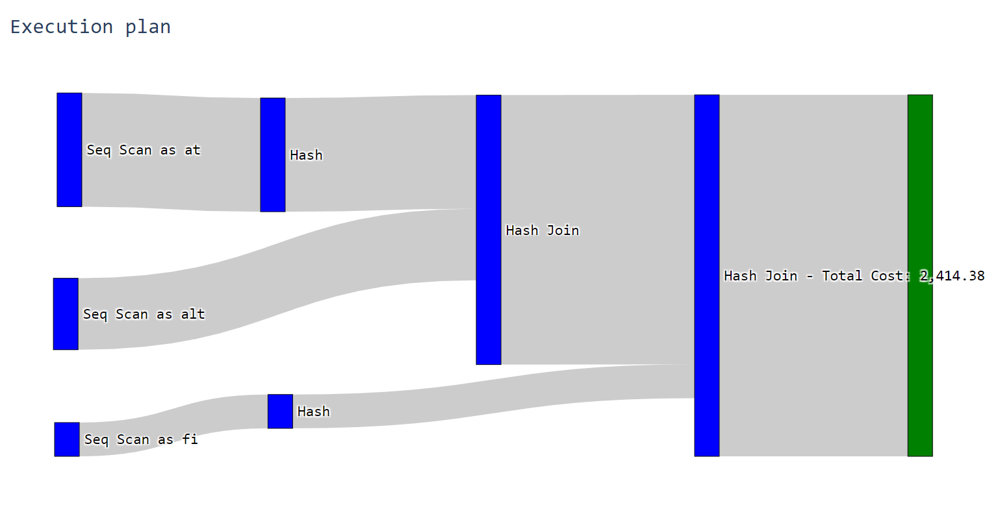
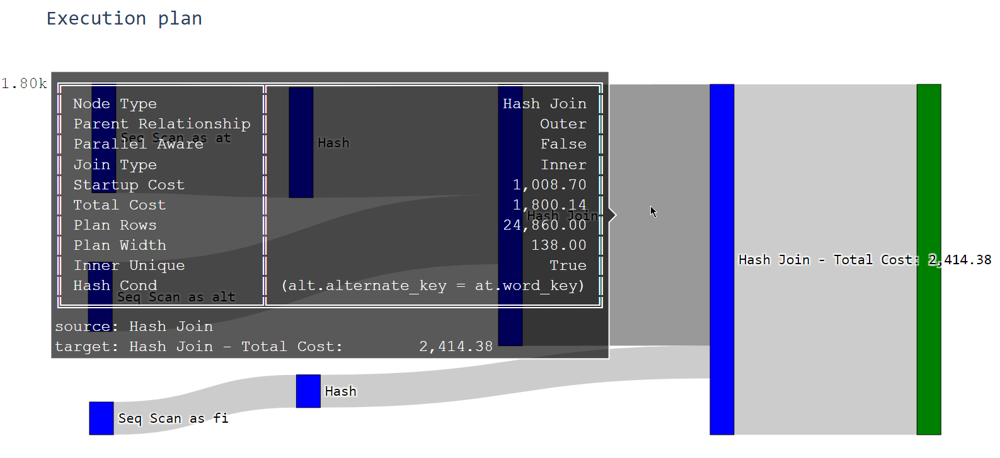

# SanQL
Visualize SQL explain plans with a sankey diagram.

Convert an explain plan from a database into a graph that lets you easily see which steps produce costs and where optimization might be useful.

Detailed information about the processes can be retrieved by hovering over the connections

The thickness of the outgoing connections represent the calculated cost for the desired action.
If your plan was generated by explain-analyze, the thickness will instead represent the real elapsed time.

The Graph will be shown in the browser. The basic variant will launch a desktop application where the plan can be entered which then launches a new browser tab.

There is also a version that, when launched, can be accessed via 127.0.0.1:5000 and lives entirely within the browser. This will work as long as the server application is kept running.

## Supported Databases
- Postgres
- Vertica

If you want additional databases to be supported, open a feature request and include a json-formatted explainplan. The more explain-plans, the easier the process will be. Mark them whether they are normal explain-plans or explain-analyze-plans.
